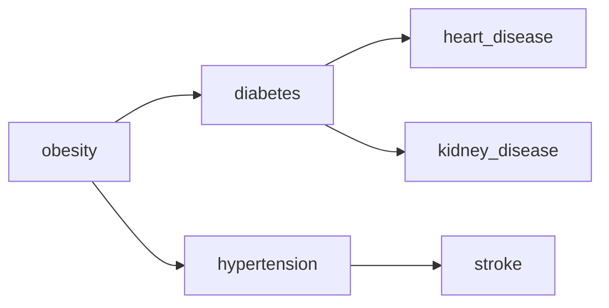

# Health Graph AI

A research-grade demo application for disease risk prediction and medical file analysis using a combination of knowledge-graph based GNN reasoning and AI-powered medical image/document analysis.

This repository contains a full-stack demo built with React + TypeScript on the frontend, and Supabase Edge Functions for server-side AI orchestration. It demonstrates how to combine a disease–symptom knowledge graph with AI models to provide explainable disease risk predictions and actionable recommendations.

---

## Table of contents

- [What it does](#what-it-does)
- [Architecture](#architecture)
- [Key technologies](#key-technologies)
- [Data](#data)
- [Getting started (local)](#getting-started-local)
- [Environment variables](#environment-variables)
- [Running the app](#running-the-app)
- [Testing / Smoke tests](#testing--smoke-tests)
- [Security & privacy](#security--privacy)
- [Contributing](#contributing)
- [License](#license)

---

## What it does

- Accepts structured patient inputs (conditions, symptoms, vitals, labs) and medical files (images, ECG PDFs).
- Runs a graph-based analysis (Graph Neural Network style reasoning) over a disease–symptom knowledge graph to **predict diseases and estimate probabilities**.
- Uses an AI image/document analysis pipeline to extract clinically relevant features from uploaded medical files (ECG, X-ray, reports) and includes those findings in the risk analysis.
- Stores predictions in `prediction_history` (Supabase Postgres) and applies Row-Level Security so users only see their own predictions.

---

## Architecture

- Frontend: React + TypeScript (Vite) UI that collects patient data, uploads files, and displays results.
- Server-side functions (Supabase Edge Functions):
  - `predict-diseases` — orchestrates the GNN-style reasoning using a disease knowledge graph and an AI completion API, returns predictions and recommendations.
  - `analyze-medical-file` — sends medical images/documents to an AI model to extract findings and summaries used by the predictor.
- Data storage: Supabase/Postgres with `prediction_history` table and RLS policies to ensure user-scoped access.
- Auth: Supabase Auth; the UI requires authentication to access the dashboard and to call analysis endpoints. Functions validate requests and reject unauthenticated calls (returns 401).
### Architecture diagrams 📊

Below are diagrams that show the high-level architecture and a sample disease knowledge graph used by the predictor. SVG files are located in `docs/diagrams/` for editing or replacement.

**High-level architecture**


You can also view/edit this flow as a Mermaid flowchart:

```mermaid
flowchart LR
  Browser[Browser (React / Vite)]
  Browser --> Frontend[Frontend App]
  Frontend -->|Invokes| Functions[Supabase Edge Functions]
  Functions --> AI[AI Gateway / LLM & Vision]
  Functions --> DB[Supabase Postgres]
  Frontend --> Auth[Supabase Auth]
  Auth --> Functions
```

**Disease knowledge graph (sample)**


A small example in Mermaid format:


### Models & reasoning
- GNN-style reasoning: We represent disease relationships as a graph (nodes: diseases / symptoms; edges: risk_factor, progression, comorbidity). The server-side code builds prompts using this graph to produce structured predictions and pathways. The implementation is designed to be explainable — each prediction includes reasoning and a pathway.
- Medical file analysis: Image/document analysis uses an AI gateway (configured via `LOVABLE_API_KEY` in this project). It behaves like an image-analysis (CNN-like) model plus LLM summarization; the function returns structured JSON (findings, risk factors, confidence, recommendations).

---

## Key technologies

- Frontend: React, TypeScript, Vite, Tailwind CSS, shadcn UI components
- Backend: Supabase Edge Functions (Deno-based), Supabase Postgres (RLS)
- AI: External AI gateway (Lovable API) for LLM & vision capabilities
- Data processing scripts: Node scripts for converting Kaggle CSV -> graph JSON

---

## Data

- `public/data/disease_symptom_graph.json` — packaged demo graph used at runtime for local dev.
- `src/data/DiseaseAndSymptoms.csv` — sample dataset that can be converted into the graph format.
- `scripts/convert-disease-symptom.js` — helper to convert CSV into the graph JSON format used by the predictor.

If you want to replace the demo graph with a larger dataset (Kaggle):
1. Download dataset (Kaggle CLI or manual download)
2. Run the converter script and inspect the resulting JSON
3. Optionally copy to `supabase/functions/predict-diseases/disease_symptom_graph.json` so the server-side function uses the same graph

---

## Getting started (local)

Prerequisites:
- Node.js 18+ (recommended)
- npm or yarn
- A Supabase project or the Supabase CLI for local emulation (optional but recommended)
- A Lovable API key (or any supported AI gateway) for model calls

1. Clone the repository

```bash
git clone <YOUR_GIT_URL>
cd health-graph-ai
```

2. Install dependencies

```bash
npm install
```

3. Create environment variables (copy and edit `.env.local` or set your shell env vars). At minimum set:

- `VITE_SUPABASE_URL` – your Supabase project URL
- `VITE_SUPABASE_PUBLISHABLE_KEY` – Supabase publishable key (frontend)
- `LOVABLE_API_KEY` – API key for the AI gateway used by server functions

Example (Unix/macOS):

```bash
export VITE_SUPABASE_URL=https://xyz.supabase.co
export VITE_SUPABASE_PUBLISHABLE_KEY=your-public-key
export LOVABLE_API_KEY=sk_xxx
```

> Note: Keep `LOVABLE_API_KEY` and any service-role keys secret — never commit them to source control.

---

## Running the app

- Development server (frontend)

```bash
npm run dev
# Open http://localhost:5173
```

- Supabase Edge Functions

To test the functions locally, use the Supabase CLI (`supabase functions serve`) or deploy them to your Supabase project. The functions expect **authenticated** requests (Bearer JWT). When calling from the browser using `supabase.functions.invoke('function-name')`, the user session token is attached automatically.

- Converting data (optional)

```bash
node scripts/convert-disease-symptom.js --input /path/to/DiseaseAndSymptoms.csv --output public/data/disease_symptom_graph.json
```

---

## Testing / Smoke tests

Verify auth gating and function guards:

1. Without signing in, try to open the Dashboard -> access should be denied and you should be redirected to `/auth`.
2. Try uploading a medical file while signed out -> UI should prompt you to sign in and disallow analysis.
3. From an authenticated session, run an analysis and confirm:
   - `predict-diseases` returns structured predictions and recommendations
   - `analyze-medical-file` returns `analysis` JSON including `summary`, `riskFactors` and `confidence`
4. Try calling the functions directly without a Bearer JWT -> functions should return HTTP 401.

---

## Security & privacy

- Predictions are stored in `prediction_history` with Row-Level Security to limit access to the creating user only.
- The application requires users to sign in to access analysis features and to persist predictions.
- Do not upload protected health information (PHI) to demo or public deployments. Review your privacy and data retention needs before storing medical data.

---

## Contributing

Contributions are welcome. Suggested workflow:

1. Fork or branch the repository
2. Implement changes and add tests as needed
3. Open a pull request describing the change

Please follow the repository coding standards (TypeScript types, linting, and tests if applicable).

---

## License

This project is provided as-is for demonstration and research purposes. Check the repository license file for details.

---

If you want, I can also:
- Add a `.env.example` with the required variables
- Add a short checklist for production hardening (rate limits, auditing, key rotation)

Let me know which additions you'd like and I will make them. ✨
